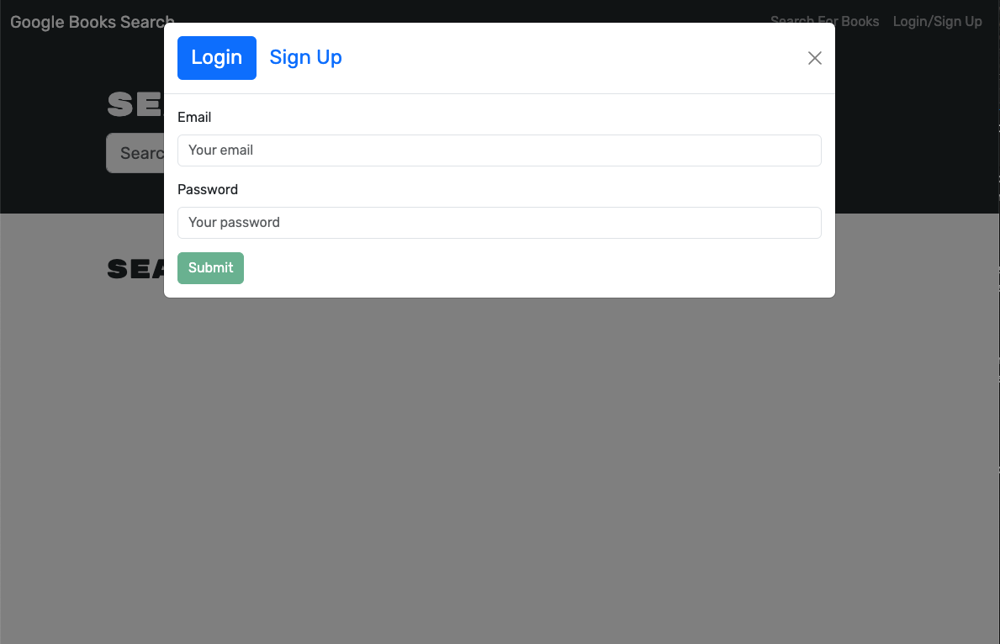

# MERN Stack Search Book Engine Refactor

[](https://opensource.org/licenses/MIT)

[Link to live deploy](https://mern-book-search-24-46c131976f67.herokuapp.com/)

## Description

This application is a search engine for Google Books, originally built with a RESTful API and later refactored to utilize GraphQL with Apollo Server. The transition to GraphQL enhances the efficiency and flexibility of data retrieval and manipulation. The application follows the MERN stack architecture, featuring a React front end, MongoDB database, and a Node.js/Express.js server and API.

## Table of Contents

- [Installation](#installation)
- [Usage](#usage)
- [Badges](#badges)
- [Features](#features)
- [Questions](#questions)

## Installation

1. **Clone the Repository**

   ```
   git clone https://github.com/ltrokey/portfoilo_react
   cd portfoilo_react
   ```

2. **Install Dependencies**

   ```
   npm i
   ```

3. **Configuration**
   - Update the connection settings as necessary in the Heroku Config Vars using MongoDb Atlas.

## Usage

1. Run the Application

   - After following the installation instructions, execute the application by running the following command:

   ```
   npm run develop
   ```

2. Explore Application

   

   **Login/Sign Up:**

   

   **Search Books & Save Favorites:**

   

   **See Your Books:**

   

## Features

- GraphQL Integration: Replaced the original RESTful API with GraphQL queries and mutations using Apollo Server, allowing for more precise and efficient data fetching and modification.

- Authentication Middleware: Adapted the existing authentication middleware to seamlessly function within the context of a GraphQL API, ensuring secure and authenticated access to resources.

- Apollo Provider: Established an Apollo Provider to facilitate communication between the client-side application and the Apollo Server, ensuring smooth data flow and interaction.

## Questions

[GitHub Profile](https://github.com/ltrokey)

Please feel free to contact me via the email link below.

[Email](mailto:trokeyln@gmail.com)
